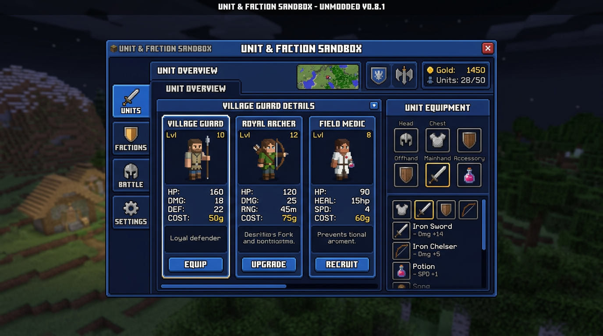

# ⚔️ LEGIONS & FACTIONS: Autonomous War Sandbox ⚔️
### *The Ultimate Autonomous Army, Faction, Cavalry & 3D Arsenal War Simulation Sandbox for Minecraft 1.21.1 (Fabric)*

```text
  ██████╗ ███████╗ ██████╗ ██╗ ██████╗ ███╗   ██╗███████╗
  ██╔══██╗██╔════╝██╔════╝ ██║██╔═══██╗████╗  ██║██╔════╝
  ██████╔╝█████╗  ██║  ███╗██║██║   ██║██╔██╗ ██║███████╗
  ██╔══██╗██╔══╝  ██║   ██║██║██║   ██║██║╚██╗██║╚════██║
  ██║  ██║███████╗╚██████╔╝██║╚██████╔╝██║ ╚████║███████║
  ╚═╝  ╚═╝╚══════╝ ╚═════╝ ╚═╝ ╚═════╝ ╚═╝  ╚═══╝╚══════╝
           &  F A C T I O N S  :  W A R  S A N D B O X
```

---

## 📜 Welcome, Commander!

Ever wanted to command a **50-strong battalion of heavily armored Royal Villager Knights charging on armored horses**, supported by **Bogged Snipers firing venom arrows**, **Tempest Breeze wind-mages**, **Pixie Combat Medics**, **Colossal 1.5x Iron Titans**, **Pyrotechnic Artillery launching firework volleys**, and **Necromancers summoning undead hordes**?

**Legions & Factions: Autonomous War Sandbox** transforms Minecraft into an **autonomous, server-authoritative tactical war simulator**. 
Create any living Minecraft entity into a custom battle template, equip it with custom **3D modeled weapons, staves, lutes, and relics**, customize its scale, mount, aura and death explosions, assign it to a faction with unique perks, place outposts, whistle army formations, transmute wild mobs, and watch legendary battles unfold!



---

## 🎮 The Commander's 3D Arsenal (13 Custom 3D Modeled Weapons & Tools)

Every non-vanilla item in **Legions & Factions** features a **custom 3D voxel-sculpted model with authentic first-person, third-person, ground, and GUI display transforms**!

| Item | 3D Model Description | Primary Action | Shift Action | Tactical Role |
| :--- | :--- | :--- | :--- | :--- |
| 📖 **Legion Creator Tool** | 3D Leather Grimoire with glowing gem | **Right-Click**: Open Creator GUI<br>**Left-Click**: Spawn unit<br>**Right-Click Unit**: Dossier | **Shift + Right-Click**: Quick-cycle<br>**Shift + Left-Click**: Spawn squad | Full unit creation, inspection & deployment |
| 📯 **Tactical Formation Whistle** | 3D Silver Trench Whistle with lanyard ring | **Right-Click**: Order troops into formation | **Shift + Right-Click**: Cycle mode (*Shield Wall, Wedge, Circle, Spread*) | Battlefield unit positioning & battlelines |
| 🌟 **Unit Transmutation Wand** | 3D Runic Rod with floating amethyst core & 4 orbit prongs | **Right-Click Mob**: Transmute/Recruit into active unit template | *Plays totem flash & syncs gear/faction* | Rapid recruitment of wild mobs |
| 💖 **Grand Healer's Divine Staff** | 3D Winged Caduceus Staff with emerald life sphere | **Right-Click**: Cast 16-block restoration wave (8 HP + Regen II + Cleanse) | *Cooldown: 5s* | Direct army healing & support |
| 🌿 **Oakbound Druidic Staff** | 3D Gnarled Oak Branch with nature bloom | **Right-Click**: Cast Entangling Roots & Healing Surge | *Roots foes with Slowness V & heals allies* | Area-of-effect crowd control & druid magic |
| 🎶 **Harmonic War Lute** | 3D Acoustic War Lute with golden tuning pegs | **Right-Click**: Strum Inspiring Battle Hymn | *Grants Speed II, Resistance & Regen (18 blocks)* | Army-wide morale & combat buffs |
| 💣 **Handheld Siege Mortar** | 3D Cast-Iron Mortar Cannon with brass reinforcement | **Right-Click**: Launch ballistic airburst mortar shell | *Explodes with heavy AoE splash damage* | Long-range siege bombardment |
| ⚡ **Sunforge Paladin Warhammer** | 3D Heavy Holy Warhammer with radiant gold crosses | **Right-Click / Strike**: Unleash Holy Radiant Smite | *Deals 2x damage to Undead + grants Absorption* | Holy melee smite & team shielding |
| 🗡️ **Shadowfang Obsidian Dagger** | 3D Serrated Obsidian Blade with skull pommel | **Right-Click**: Shadow Step Blink (6 Blocks) | *Grants Invisibility & Speed III for backstabs* | Stealth flanking & high-value assassination |
| 🪄 **Faction Commander's Scepter** | 3D Royal Gold & Sapphire Crowned Scepter | **Right-Click Block**: Set Move/Rally waypoint<br>**Right-Click Enemy**: Mark focus target | **Action bar**: View active troops in radius | Real-time battlefield tactical command |
| 🎺 **Commander's Tactical War Horn** | 3D Curved Brass & Gold Battlehorn with pennant | **Right-Click**: Sound rally horn (Area Strength & Speed) | **Shift + Right-Click**: Cycle orders (*Rally / Charge / Hold*) | Morale boosts & squad rally |
| ⚡ **Reinforcement Drop Beacon** | 3D Heavy Stabilized Beacon Core with emitter array | **Right-Click Block**: Call down a 4-unit elite drop wave | *Cooldown: 10s* | Emergency frontline reinforcements |
| 🚩 **Faction Outpost Standard** | 3D Standard Flagpole with crossbeam and tassel | **Right-Click Block**: Establish faction outpost territory | *Defensive Zone: 32 blocks* | "Home Turf" territorial defense |

---

## 🛡️ Tactical Roles & Specialized Combat Behaviors

```text
                     [ CAVALRY & VANGUARD ]
               🐎 Armored Knights on Warhorses
               💀 Dread Wither Cavalry on Skeleton Steeds
               🕷 Spider Riders & Wolf Cavalry
                         │
                     [ FRONT LINE ]
               ⚔ Melee Tanks & Knights
               🛡 Shield Wall Formations
               ⚡ Colossal Iron Titans (1.35x Scale)
               🔨 Sunforge Holy Paladins
               🦏 Ravager Earthshakers
                         │
                     [ MID LINE ]
               🏹 Ranged Marksmen & Bogged Poison Snipers
               💣 Siege Bombardiers (Hand Mortars)
               🎆 Pyrotechnic Fireworks Artillery
               🌪 Tempest Breeze Wind Casters
               🧙‍♂️ Evoker Fang Spellweavers
                         │
                     [ BACK LINE ]
               💖 Field Medics & Allay Pixie Healers
               🌿 Oakbound Grove Druids
               🎶 Battlefield Bards (Harmonic War Lutes)
               ☠ Dark Necromancers & Undead Summoners
               👑 Commanders & Tacticians
```

### 1. 🐎 Mounted Cavalry System (`MountedCavalrySpawner`)
- Units can ride **Armored Warhorses**, **Skeletal Steeds**, **Cave Spiders**, **Dire Wolves**, and **Ravagers**.
- Mounted units gain increased movement speed, charge impact knockback, and synchronized rider AI!

### 2. 📏 Entity Scaling (0.25x Miniature to 5.0x Colossus)
- Scale any warrior up or down via the attributes engine (`EntityAttributes.GENERIC_SCALE`).
- Create colossal **Iron Titan Juggernauts** or miniature **Goblin Swarms** with matching hitboxes and step heights!

### 3. 🧠 Dynamic Morale & Panic System (`MoraleSystem`)
- **Commander Casualties**: When a squad leader dies, recruit-tier units suffer **Morale Break** (retreating in panic with crying particles).
- **Vengeance Rage**: Veteran and Captain units enter **Vengeance Fury** (+40% speed and damage) to avenge fallen officers!

### 4. 🌪️ 1.21 Special Mob AI Routines (`SpecialEntityAI`)
- **Breeze**: Fires howling wind bursts (`GUST_EMITTER_LARGE`) knocking enemies 15+ blocks back and into the air.
- **Bogged**: Fires lingering poison sniper arrows from long range with slime trail VFX.
- **Evoker**: Casts piercing ground fangs in straight offensive lines towards hostile troop formations.
- **Witch**: Intelligently switches between casting healing mist on injured allies and throwing weakness/poison curses at enemy ranks.
- **Ravager**: Roars and executes an earth-shattering ground stomp launching enemy clusters high into the air.
- **Wolf Pack**: Howls in unison to grant all nearby allied wolves pack speed and strength buffs.
- **Wither Skeleton**: Performs dark shadow dashes that inflict Wither II.
- **Warden**: Emits devastating sonic boom shockwaves across large combat distances.

### 5. ✨ Particle Auras & 💥 Death Actions
- **Custom Visual Auras**: `Flame`, `Soul Flame`, `Enchanted Hit`, `Portal`, `Heart`, `Totem of Undying`, `Electric Spark`.
- **Lethal Death Actions**: `Explosion`, `Healing Mist`, `Victory Fireworks`, `Lightning Strike`, `Poison Cloud`.

### 6. 🏆 Automatic Battle Victory Detection (`BattleSandbox`)
- Start any size clash (8v8, 16v16, 24v24) between two factions.
- Real-time ticker monitors active troop casualties and automatically broadcasts the winning faction with victory fireworks, fanfare sound effects, and persistent scoreboard kill counters!

---

## ⭐ Veteran Progression System

Surviving warriors gain battle experience and battlefield promotions!

```text
  [ Recruit ] ────► [ Veteran ] ────► [ Elite Champion ] ────► [ Legendary Hero ]
   0-2 Kills          3 Kills              7 Kills                15 Kills
                   +4 Max Health        +8 Max Health          +15 Max Health
                   +1.0 Damage          +2.0 Damage            +3.5 Damage
                   Golden Title         Resistance I Aura      Strength I & Glowing
```

---

## 🏛️ Default Factions & Relations Matrix

```text
 ┌───────────────────────┬────────────┬──────────────────────────────────────┐
 │ Faction               │ Color      │ Signature Units                      │
 ├───────────────────────┼────────────┼──────────────────────────────────────┤
 │ 🔵 Kingdom of Eldoria │ Royal Blue │ Royal Knights, Archers, Medics, Pyro │
 │ 🔴 Iron Raiders       │ Red        │ Berserkers, Bombardiers, Alchemists  │
 │ 🟢 Village Alliance   │ Emerald    │ Town Militia, Druids, Iron Titans    │
 │ 🟣 Undead Legion      │ Purple     │ Necromancers, Dread Cavalry, Bogged  │
 │ 🔷 Arcane Order       │ Cyan       │ Bards, Tempest Breeze, Pixie Medics  │
 └───────────────────────┴────────────┴──────────────────────────────────────┘
```

---

## 🖥️ 5-Tab Interactive Creator Dashboard

```text
  ┌────────────────────────────────────────────────────────────────────────┐
  │ [⚔ EDITOR]  [📋 UNITS]  [🛡 FACTIONS]  [💥 BATTLE]  [⚙ SETTINGS]       │
  ├────────────────────────────────────────────────────────────────────────┤
  │                                                                        │
  │  [⮜ Next Unit]     [➕ Duplicate]         [💾 Save Slots]             │
  │  [Entity: Cycle]   [Role: Cycle]          [⚔ Spawn Unit (1)]          │
  │  [Faction: Cycle]  [Rank: Cycle]          [🛡 Spawn Squad (5)]         │
  │  [Mount: Cycle]    [Aura: Cycle]          [🗑 Delete Unit]             │
  │  [Death: Cycle]    [Scale: Cycle]                                      │
  │  [Commander: Toggle ON/OFF]                                            │
  │                                                                        │
  │  Equipment Slots:  [ H ] [ C ] [ L ] [ F ]  |  [ Main ] [ Offhand ]    │
  │  Unit Inventory:   [ 1 ] [ 2 ] [ 3 ] [ 4 ] [ 5 ] [ 6 ] [ 7 ] [ 8 ] [ 9] │
  │  Player Inventory: (Drag-and-drop any gear, weapons, food, potions)   │
  └────────────────────────────────────────────────────────────────────────┘
```

---

## 🕹️ Command Reference

```bash
# Unit Management & Customization
/unit list                                    # List all saved unit templates
/unit stats                                   # View persistent battle statistics
/unit spawn <id> [count] [x y z]              # Spawn unit at player or coordinates
/unit squad <id> [count]                      # Spawn structured squad
/unit create <id> <entity> <name>             # Create new template
/unit delete <id>                             # Delete template
/unit duplicate <id>                          # Clone template
/unit equip <id> <slot> <item>                # Equip armor or weapons
/unit inventory <id> <item> [count]           # Add ammunition, food, potions, blocks
/unit set <id> health/damage/speed/armor <v>  # Edit attribute
/unit set <id> scale <0.25 - 5.0>             # Set entity visual scale
/unit set <id> mount <entity_id>              # Set cavalry mount (e.g. minecraft:horse)
/unit set <id> aura <flame|portal|heart|...>  # Set visual particle aura
/unit set <id> death <explosion|healing|...>  # Set death effect action
/unit set <id> role <role>                    # Set combat role (melee, ranged, etc.)
/unit set <id> rank <rank>                    # Set rank (soldier, captain, etc.)
/unit set <id> squad <name>                   # Assign squad name
/unit set <id> commander <true|false>         # Toggle commander status

# Factions & Diplomacy
/faction list                                 # List all factions
/faction create <id> <name>                   # Create new faction
/faction relation <from> <to> <relation>      # Set ALLIED, NEUTRAL, HOSTILE
/faction perk <faction> <perk>                # Add faction perk

# Battle Sandbox
/battle start <faction1> <faction2> [size]    # Deploy armies in battlefield formation
/battle clear                                 # Despawn all active battle mobs
/battle stats                                 # View kills & deaths scoreboard
/battle reset                                 # Reset statistics
```

---

## ⚡ Performance & Server Authority

* **100% Server Authoritative**: Client screens only send validated requests; all spawning, stats, inventory, equipment, and AI execute on the server.
* **Spatial & Throttled Queries**: AI ticks every 10 ticks and uses spatial bounding box queries—**zero full-world O(N²) scans**.
* **Zero Zombification in Overworld**: Piglin and Piglin Brute units automatically have zombification disabled so Nether units can fight in the Overworld!
* **Sunlight Protection**: Custom undead units (Zombies, Skeletons) do not burn during daytime battles.
* **Persistent World Data**: All units, factions, relationships, perks, and battle statistics persist across world reloads and server restarts.

---

### 📦 Build & Requirements
* **Minecraft Version**: `1.21.1`
* **Fabric Loader**: `>=0.16.10`
* **Fabric API**: `0.116.17+1.21.1`
* **Java**: `21`
