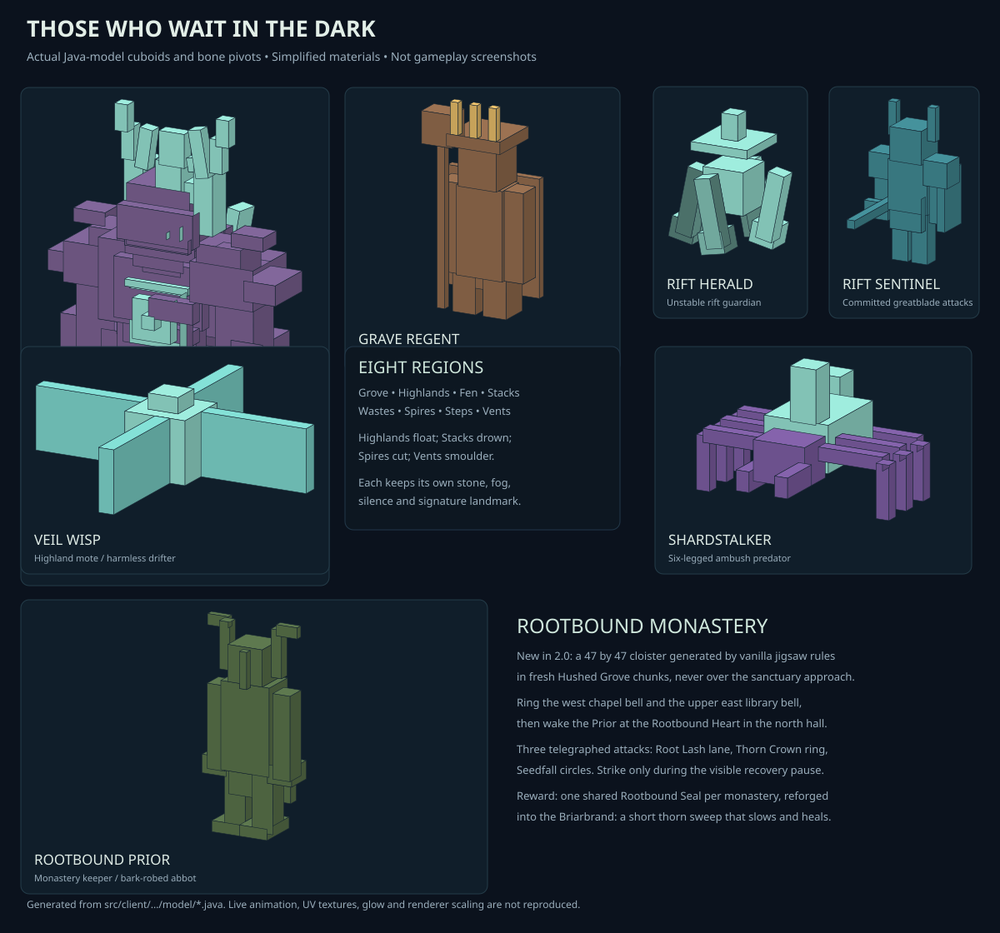
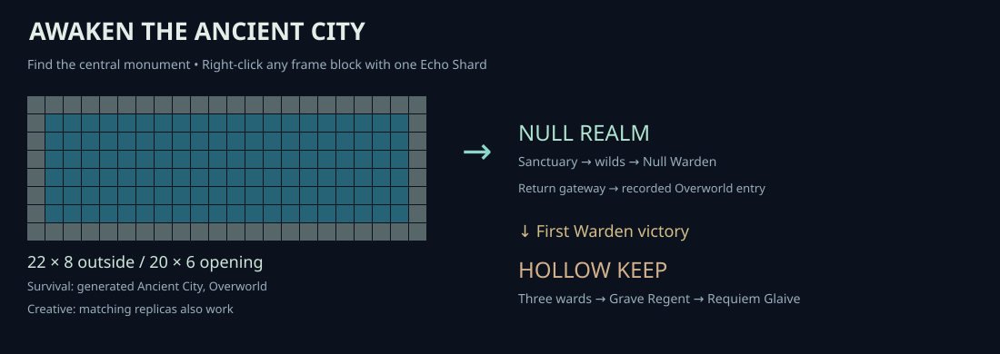
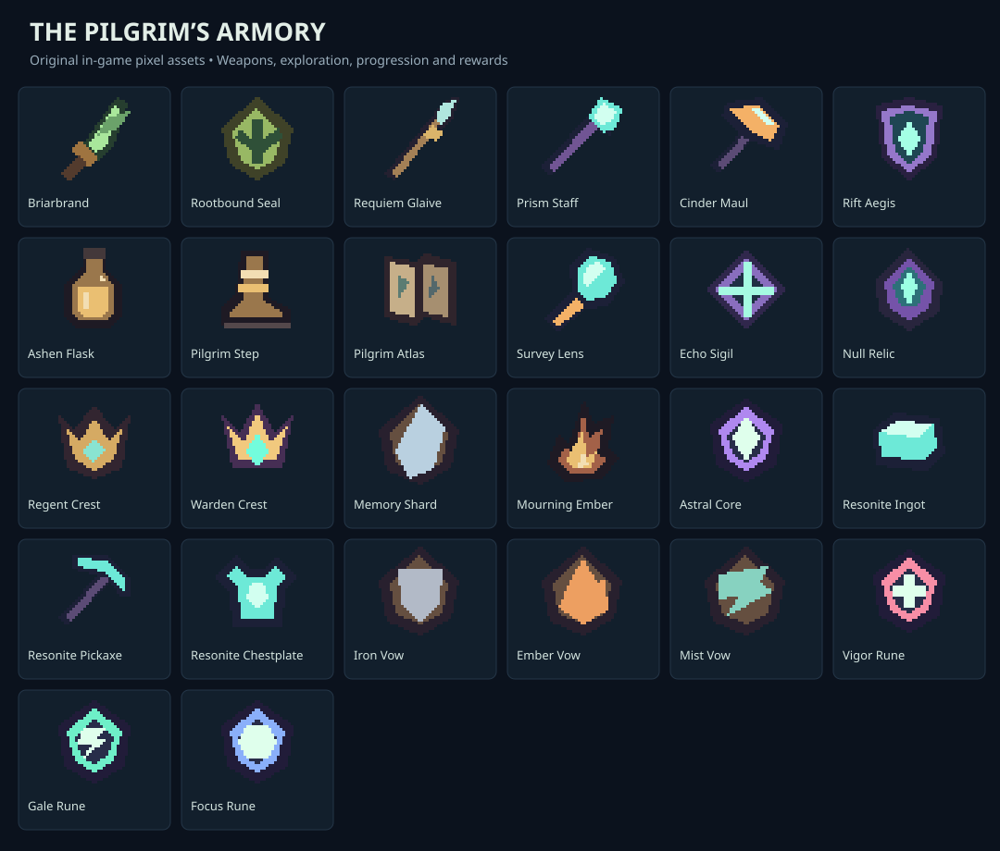
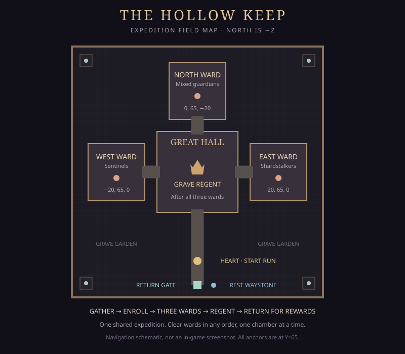
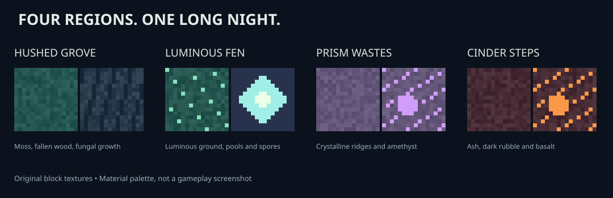

# The Null Warden
## 2.0 alpha — The Kingdom Beyond the Gate

**A dark-fantasy expedition through a ruined kingdom: awaken the great Ancient City gate, prepare at a sanctuary, ring the bells of a drowned-root monastery, recover forgotten memories, descend beneath cathedrals, and challenge the guardians of a broken realm.**

> **2.0.0-alpha.1** is the first milestone of the 2.0 plan: one fully built dungeon, one new keeper, and a gateway that now has an arrival moment. It is an alpha — see [the Kingdom record](docs/KINGDOM.md) for exactly what is and is not verified.

Built for **Minecraft 1.21.1 · Fabric · Java 21**. The mod includes an exploration dimension and a separate fortress dimension, four realm biomes, original creature models, exploration landmarks, equipment progression, opt-in encounters, and persistent player records.

[Download builds](https://github.com/Qynl/MyFirstMod/actions/workflows/build.yml) · [Report an issue](https://github.com/Qynl/MyFirstMod/issues) · [Validation details](docs/TESTING.md)

> **Development build:** automated compilation, rule/resource tests, and dedicated-server smoke tests are used. They do not establish visual polish, combat balance, multiplayer reliability, or modpack compatibility. Back up saves and try a disposable world first. New landmarks require **new chunks**.

---

## Contents

- [New in 2.0 alpha — The Kingdom Beyond the Gate](#new-in-20-alpha--the-kingdom-beyond-the-gate)
- [The Rootbound Monastery](#the-rootbound-monastery)
- [New in 1.8 — The Ancient Threshold](#new-in-18--the-ancient-threshold)
- [New in 1.7 — The Hollow Keep](#new-in-17--the-hollow-keep)
- [What is new in 1.6?](#what-is-new-in-16)
- [Install and update](#install-and-update)
- [Enter the Null Realm](#enter-the-null-realm)
- [Your first expedition](#your-first-expedition)
- [Biomes and landmarks](#biomes-and-landmarks)
- [Memories, contracts, and trading](#memories-contracts-and-trading)
- [Swear a vow](#swear-a-vow)
- [Navigation and recall](#navigation-and-recall)
- [Rest, healing, and evasion](#rest-healing-and-evasion)
- [Enemies and counterplay](#enemies-and-counterplay)
- [Courts, cathedrals, and rifts](#courts-cathedrals-and-rifts)
- [The Warden and rematches](#the-warden-and-rematches)
- [Equipment and crafting](#equipment-and-crafting)
- [Building and cultivation](#building-and-cultivation)
- [Multiplayer and persistence](#multiplayer-and-persistence)
- [Troubleshooting and limitations](#troubleshooting-and-limitations)
- [Build, tests, and repository guide](#build-tests-and-repository-guide)

## New in 2.0 alpha — The Kingdom Beyond the Gate



- **A generated dungeon:** the **Rootbound Monastery**, an original 47×47 cloister placed by vanilla jigsaw rules in **new Hushed Grove chunks** — north chapterhouse, west chapel, two-storey east library with a real stair, colonnade, root garden, two spawners and two caches. It never starts inside the sanctuary approach.
- **A two-bell rite:** ring the west chapel bell and the upper library bell, then wake the keeper at the Rootbound Heart. Bell progress is stored in the block state, so it survives unloads, restarts, and rotated placement.
- **A new boss:** the **Rootbound Prior**, altar-bound and unhurried — three telegraphed attacks with a one-second recovery pause, and a second rotated Thorn Crown pulse below half health. Four root pillars give partial cover.
- **A real reward:** one shared **Rootbound Seal** per monastery, reforged into the **Briarbrand**, a fast narrow thorn sweep that slows and heals. The seal has no other use, so monasteries stay worth finding.
- **An arrival moment:** the Ancient City gate now **awakens over three seconds** — light climbs both posts, the anchor charge rises in pitch — and stepping away or swapping the shard cancels it without consuming anything.
- **A counterpart gateway:** new worlds arrive at **(0, 81, 172)** facing a matching 22×8 reinforced frame on the far side of a larger, lamp-inlaid plaza. Existing saves keep their current sanctuary untouched.
- **Grove identity:** a quarter of suitable grove chunks now raise great **root arches** between landmarks.

**Honest status:** compilation, 23 Python resource tests, 42 JUnit methods and a dedicated-server smoke test that places the real template and runs the custom structure type all pass. No connected client has walked the monastery, fought the Prior, or seen the awakening particles; balance and natural structure spacing are unverified. Details and limits: [docs/KINGDOM.md](docs/KINGDOM.md).

## The Rootbound Monastery

| Step | What to do |
| --- | --- |
| Find it | Explore **new** Hushed Grove chunks; at most one monastery per 32×32-chunk region, at least 16 chunks apart. Bind the entrance **Waystone** at the south doorway |
| Ring both bells | West chapel bell on the ground floor; east library bell on the upper gallery, reached by the two-wide stair |
| Wake the keeper | Right-click the **Rootbound Heart** in the north chapterhouse once both bells have rung. Blocked space or Peaceful difficulty refuses safely |
| Fight | Leave the marked lane, take the centre pocket or stand outside radius 7 for the crown, and step out of your own Seedfall circle. Strike during the recovery pause |
| Claim | The heart becomes a reliquary: one **Rootbound Seal**, 3 Resonite Ingots, 1 Dusk Fiber, 250 XP. The cloister screen opens as a shortcut |

The Prior scales from 240 health solo to 540 with four eligible players, never moves, and never
despawns mid-fight. If it is removed by a command or its chunk is abandoned, the heart frees
itself after six seconds with a player nearby, so the monastery is never permanently locked.

## New in 1.8 — The Ancient Threshold

**The great Ancient City monument is now your entrance.** Awaken the existing reinforced-deepslate frame with an Echo Shard and step through its full twenty-block-wide veil. No tiny handmade frame, catalyst search, or ignition corner.



- **Vanilla-template-sized gateway:** 22×8 outside, 20×6 inside, either horizontal axis. Right-click any frame block; Survival requires an actual Ancient City structure in the Overworld. One Echo Shard opens all 120 portal blocks.
- **New terrain composition:** broad basins, folded ridges, shallow winding ravines, underground fractures, and a distinct subsurface stone band. The realm is still explorable ground—not a flat arena or an End preset.
- **More biome scenery:** moss carpets, mushrooms, fallen wood, crystal buds, basalt rubble, and carefully bounded fen pools between landmarks. Regional ambient loops complement fog and particles.
- **Gateway presentation:** an original animated teal/violet membrane, thin axis-aware geometry, opening sound and particles. Already-active gates cost nothing; obstructed gates never carve through builds.
- **Hollow Keep lighting:** integrated hall and ward-room lamps make its silhouettes easier to read. Existing Keep architecture is not rebuilt on upgrade.
- **Illustrated guide:** actual item textures, source-derived creature geometry, biome material plates, gateway diagram, and fortress map. These are **not gameplay screenshots**.

### Items and equipment



These are the mod's actual PNG item assets, enlarged without smoothing. See [equipment and crafting](#equipment-and-crafting) for their mechanics.

### Bosses and creatures


**Model-preview disclosure:** geometry and bone pivots are read from the real Java model sources. Material colors are simplified; Minecraft UV textures, glow, live animation, and renderer scale are not reproduced. These previews show silhouettes, not a claim of in-game visual verification.

## New in 1.7 — The Hollow Keep

A separate dungeon dimension with a **63×63 fortress**, three ward chambers, a large central hall, and the **Grave Regent**, an original custom-modeled boss. The first clear awards the **Requiem Glaive**. This is a shared, repeatable expedition—not another small worldgen ruin. See [the complete Keep guide](docs/HOLLOW_KEEP.md).

After the Warden has fallen, use the Hollow Gate at **(-6,81,158)**. The first use prepares the fortress; use it again once ready. Your existing flasks, vows, and Resonite set bonus work there. Read the guide before starting a party expedition.



## What is new in 1.6?

This update connects exploration to long-term preparation rather than adding only another boss:

- **Forgotten memorials:** three generated layouts—broken bell towers, pilgrim shelters, and grave gardens—with supply caches and readable Memory Stelae.
- **Six short lore passages** and per-player remembrance rewards. A memorial can reward each player once.
- **Seven permanent milestone contracts** covering biomes, memories, courts, cathedrals, rifts, and the Warden.
- **Pilgrim Ledger:** claim contracts and exchange Memory Shards for repairs, ammunition, sigils, and metal.
- **Three persistent vows:** Iron, Embers, and Mist each grant a benefit with a burden; Silence removes a vow.
- **Pilgrim Atlas:** bounded surveys of already-loaded terrain, five landmark categories, remembered destinations, and a directional HUD.
- The 1.6 handcrafted-frame route is **retired in 1.8**; use the Ancient City monument instead. Existing active portals remain usable.
- New recipes, original pixel assets, journal pages, persistent save fields, and expanded automated checks.

Everything from earlier updates remains: Ashen Flasks, cathedral embers, Convergence encounters, relic attunement, farming, custom armor/tools, court tiers, and Warden rematches.

## Install and update

| Requirement | Target |
| --- | --- |
| Minecraft | **1.21.1**, Java Edition |
| Mod loader | **Fabric Loader 0.16.10** development target; metadata accepts 0.16.10+ |
| Fabric API | Built against **0.116.17+1.21.1**; install a compatible 1.21.1 build |
| Java | **21** |
| Mod version | **2.0.0-alpha.1** |

1. Install Fabric for Minecraft 1.21.1.
2. Open a **successful** [build workflow run](https://github.com/Qynl/MyFirstMod/actions/workflows/build.yml).
3. Download its `Null-Warden-<commit>` artifact and extract the ZIP. GitHub may require sign-in to download artifacts.
4. Put the installable mod JAR and Fabric API in `mods/`. Do not install the `-sources.jar`.
5. On a dedicated server, install the same mod version and compatible Fabric API on **both server and clients**.

**Updating:** stop the game/server, back up the entire world, remove the older mod JAR, and install the new one. Do not keep two versions installed. A fresh test world best demonstrates the full terrain; old chunks remain unchanged and may meet new terrain at visible seams.

Existing expedition progress is retained. Sanctuary upgrades only fill designated **empty** blocks; they do not replace an occupied player build. If an upgrade station is missing because its position was occupied, craft a replacement ledger/forge or use another waystone.

## Enter the Null Realm

1. Find an **Ancient City in the Overworld** and reach the large central reinforced-deepslate monument. Vanilla does not activate this structure; this mod supplies that behavior.
2. Bring **one Echo Shard**, obtainable from Ancient City loot. You do not need to mine or craft reinforced deepslate.
3. Preserve the complete **22-block-wide × 8-block-tall outline**, including corners. The **20×6 opening** must contain only air or already-active portal blocks. Clear obstructions yourself; activation does not destroy them.
4. **Right-click any reinforced-deepslate frame block with the Echo Shard**, in either hand, and **keep holding it still for three seconds** while the frame awakens. Walking 32+ blocks away, changing dimension, dying, or swapping the shard out of that hand cancels the awakening. The shard is consumed only on a successful opening; Creative consumes nothing.
5. Step through the teal veil. City rotations are supported in both the X/Y and Z/Y planes.

The gateway brings you to the **Hushed Threshold**: **(0, 81, 172)** in worlds first entered on 2.0+, facing the realm-side counterpart of the city frame, or **(0, 81, 160)** in saves that already had a sanctuary. A return gate is available immediately—defeating the boss is not required to leave. Return-point information survives restarts; returning searches for supported, collision-free, dry space near the original entry rather than placing you inside the membrane. If the return landing is blocked, the saved point is retained and the return fails safely.

**Creative/testing:** matching 22×8 replicas can be activated outside cities. Operators can run `/nullgate x y z` against a frame block to validate and open a fixture without a player; this deliberately bypasses the Survival location/item checks. See [the gateway implementation and test notes](docs/ANCIENT_CITY.md).

**Old saves:** active small portals continue working. The old reinforced-deepslate recipe and new small-frame ignition are removed. Existing crafted blocks are not deleted. New terrain and scenery appear only in **new chunks**; back up your world before upgrading and expect visible terrain seams at old boundaries.

## Your first expedition

1. **Read your Null Expedition journal.** Reopen it to refresh progress and instructions.
2. **Keep the Resonance Compass.** It routes to the arena, sanctuary, or a discovered ready court.
3. **Collect the starter kit.** Your first realm visit after the Pilgrimage update grants an Ashen Flask and Pilgrim's Step once per player. Replacements are craftable.
4. **Bind the sanctuary waystone**, then practice resting with the flask. The forge, waystone, and ledger are near the arrival platform.
5. **Mine and gather.** Smelt Resonite, gather staff ammunition, and harvest Hush Leaves for food/fiber.
6. **Craft a Pilgrim Atlas.** Survey nearby loaded terrain for landmarks rather than wandering without a destination.
7. **Read memorials.** Spend Memory Shards on supplies or craft a vow that suits your approach.
8. **Explore a cathedral.** Defeat or suppress its spawners, solve its rite, and strengthen your flask with a Mourning Ember.
9. **Try courts and Convergence rifts.** These are opt-in encounters, not automatic fights when you pass by.
10. **Follow the causeway to the Warden.** Victory unlocks higher court progression, the Nullblade/Heart, and rematches.

| Sanctuary landmark | Coordinates |
| --- | --- |
| Arrival | `(0, 81, 160)` |
| Attunement Forge | `(-6, 81, 160)` |
| Waystone | `(6, 81, 160)` |
| Pilgrim Ledger | `(6, 81, 158)` |
| Hollow Gate, unlocked after Warden victory | `(-6, 81, 158)` |
| Echo Altar, near arena | `(8, 81, 30)` |

Do not build a permanent base in the Warden arena: encounter preparation rebuilds its combat footprint. The reserved central approach excludes random exploration features.

## Biomes and landmarks

The realm uses its **own noise settings**, not the End preset. Low-frequency basins shape the large terrain; folded ridges and smaller fractures add relief. A separate winding-ravine field cuts into the surface but is bounded vertically so it does not slice every valley down to bedrock. Underground tunnels remain below Y=48. Bring blocks and your Pilgrim’s Step for broken terrain.



*Material reference, not generated landscape screenshots. New scenery remains inside its owning chunk, avoids the reserved sanctuary approach, and skips chunks whose center is occupied by landmark blocks.*

| Biome | What to look for |
| --- | --- |
| **Hushed Grove** | Leaning Hushwood, branching canopies, harvestable leaves, moss, hanging lights |
| **Prism Wastes** | Clustered crystal spears, Prismstone, violet atmosphere |
| **Cinder Steps** | Ash, basalt/cinder formations, increased Cinder selection in ore generation |
| **Luminous Fen** | Glowing moss, shallow pools, luminous growths, teal fog |

| Landmark | Purpose |
| --- | --- |
| Ruin court | Supply cache and an opt-in Resonance trial |
| Archive vault | A sunken second storey, staircase, and deeper treasure cache |
| Waystone shrine | Bind a recall destination and find supplies |
| Convergence observatory | Ground seals, defeat the Rift Herald, earn Astral Cores |
| Mourning Cathedral | Three levels, spawners, funerary puzzle, flask-upgrade ember |
| Forgotten memorial | Bell tower, shelter, or grave garden; per-player memory reward and a shared supply chest |

These are **code-generated, chunk-contained features**, not sprawling multi-chunk castles or `/locate structure` entries. Cathedrals occupy a 15×15 footprint with a nave above two underground floors. Terrain and feature checks can reject a placement; rarity values are not guarantees that every selected chunk contains a landmark.

## Memories, contracts, and trading

### Forgotten memorials

Use a **Memory Stele** to read one of six passages and gain **one Memory Shard + 25 XP**. The stele remains, so other players can recover their own memory. Revisited stelae still show their lore, and recovered passages appear as journal pages. Your reward is tied to that coordinate and can only be claimed once.

A player record stores up to **256 rewarded memorial coordinates**. At the cap, additional stelae do not reward shards; old entries are not evicted to enable repeat farming. Memory Shards are physical, tradeable items. They are distinct from Resonant Shards and Mourning Embers.

### Seven contracts

Use a **Pilgrim Ledger without Memory Shards in your main hand** to view contract status and automatically claim all newly eligible rewards. Contracts are always active, need no acceptance step, and each pays once per player. Existing saved accomplishments count.

| Requirement | Memory Shards |
| --- | ---: |
| Visit two different realm biomes | 2 |
| Remember three different memorials | 3 |
| Complete three courts | 4 |
| Open a cathedral reliquary | 4 |
| Close two Convergence rifts | 5 |
| Complete court tier 3 or higher | 6 |
| Defeat the Warden | 6 |
| **Total one-time contract rewards** | **30** |

### Supply exchange

**Sneak-use** the ledger to cycle offers. Then hold enough Memory Shards in your **main hand** and use it normally to buy the selected offer. Only that held stack is used as payment.

| Offer | Cost |
| --- | ---: |
| 2 Repair Kits | 2 Memory Shards |
| 24 Prism Dust | 2 Memory Shards |
| 2 Echo Sigils | 3 Memory Shards |
| 12 Resonite Ingots | 4 Memory Shards |

The ledger works only in the Null Realm. Craft one with **book + Hush Planks + Resonite Ingot**. Contracts and offer selection belong to the player, not the block; placing extra ledgers does not reset rewards.

## Swear a vow

Vows are **player specializations**, separate from an individual weapon's attunement. Use a seal near a **safe realm waystone** to consume it and replace your current vow. There is one vow slot and a **60-second shared, persistent change cooldown**.

| Vow | Benefit | Burden | Shapeless recipe |
| --- | --- | --- | --- |
| **Iron** | Resistance I | Slowness I | 2 Memory Shards + Resonite Ingot |
| **Embers** | Strength I | Hunger I | 2 Memory Shards + Cinder Pearl |
| **Mist** | Speed I | Weakness I | 2 Memory Shards + Dusk Fiber |
| **Silence** | Return to Unbound | Removes the vow | Paper + Hushberry |

The chosen vow survives death, gear swaps, and restarts. Its effects refresh for living Survival/Adventure players **inside the realm**, not Creative or spectator players. Flasks, vows, and the full Resonite set bonus also operate in the Hollow Keep using the same player record. Effects naturally linger up to **three seconds** after leaving or changing vows. Vanilla potion stacking rules apply; existing stronger effects are not forcibly removed. Strength/Weakness affect ordinary melee, not every scripted relic ability.

Safety uses the flask's rest checks: grounded, near a waystone, no nearby living hostiles, and no relevant enrolled encounter. Selecting the same vow or attempting a change too soon does not consume the seal.

## Navigation and recall

### Resonance Compass

The original animated compass still serves its focused purpose:

- Ordinary use refreshes its destination.
- Sneak-use cycles **Warden arena → sanctuary → nearest known ready court**.
- Court readiness is checked when used, not continuously.
- Discover courts by interacting with their cores; the saved list retains up to 128.
- Replacement: **compass + echo shard**.

### Pilgrim Atlas

Craft **compass + book + Prism Dust**. Use it in the realm to survey and refresh a route; **sneak-use cycles five categories**:

**Waystone → Court → Convergence Observatory → Mourning Reliquary → Unread Memorial**

Holding it shows the selected category, horizontal distance, and ahead/behind/left/right bearing. Chat reports the destination's full coordinates.

**What a survey actually does:** checks the center columns of a 9×9 chunk grid around your current chunk, between Y=12 and Y=180, and skips unloaded chunks. Ordinary surveys have a five-second cooldown. Interacting with supported landmarks also records their exact positions.

The atlas remembers up to **128 positions**, evicting the oldest stored entry when adding beyond that limit. It is **not a map renderer, global locator, chunk loader, or teleport item**. It can miss non-center/custom-built landmarks until interacted with. Known markers in unloaded chunks may be stale; loaded markers are checked and removed if the landmark is gone. Memorial routing skips places you already rewarded. Atlas court routing does not filter encounter cooldowns; use the Resonance Compass for that.

### Wayfarer Thread

Use a waystone to bind your personal destination. Hold a Thread for **three seconds** to recall; sneak while finishing to return to the sanctuary instead. An unbound Thread uses the sanctuary.

Damage interrupts the channel. Enrolled trials/rifts and nearby active Warden combat block recall. A successful recall has a **60-second cooldown**. It deliberately loads the destination chunk, then searches for a supported, collision-free landing without replacing blocks. A missing/obstructed stone fails without spending the cooldown.

## Rest, healing, and evasion

### Ashen Flask

- Hold use for **1.6 seconds** to restore **four hearts**, consuming one charge.
- Starts with **three charges per player** and a four-second drinking cooldown.
- Damage interrupts use; a full-health player cannot start drinking.
- **Sneak-use for five seconds near a safe waystone** to refill charges and restore health.
- Rest with a **Mourning Ember offhand** to permanently add one charge, up to **five**. Hold the flask main-hand.
- Charges belong to your saved player record. Extra flasks, trading, or relogging do not refill them.
- Expedition dimensions only (Null Realm and Hollow Keep); replacement recipe: **glass bottle + Resonite Ingot + Hushberry**.

Rest checks for a waystone within three blocks horizontally/two vertically, solid footing, no living hostiles within twelve blocks of your bounding box, and no enrolled court/rift or nearby active Warden fight. Checks continue throughout the channel. At maximum capacity, resting does not consume an ember.

### Pilgrim's Step

Use for a grounded forward evasion of up to **three blocks**; sneak-use backsteps. It has a **2.5-second cooldown**, adds hunger exhaustion, and provides **no invulnerability**. The path is sampled at quarter-block intervals and stops at walls, unsafe support, fluid, unloaded chunks, and ledges.

Replacement: **leather + Dusk Fiber + Resonite Ingot**. This is an item ability, not a dedicated dodge key. Normal vanilla item-use priority applies when using offhand equipment.

## Enemies and counterplay

| Enemy | Behavior | Response |
| --- | --- | --- |
| **Rift Sentinel** | Original horned knight model, greatblade, committed 32-tick forward cleave | Circle behind its 3.5-block arc, retreat, or land a player hit of at least six incoming damage during the tell to stagger it |
| **Shardstalker** | Original six-limbed crystal hunter; 30-tick fixed-position tell, physical lunge | Leave the marked position, watch the creature's actual landing, punish recovery |
| **Grave Regent** | Crowned funeral monarch in the Keep; cleave, ring, and cross-lane attacks | Clear three wards first; dodge its committed tells and use recovery windows |
| **Rift Herald** | Original floating construct with crown and orbiting shards; bursts and ring attacks | Leave the burst circle; for the ring, stay within three blocks or beyond six |
| **Rootbound Prior** | Monastery keeper: 3-second tells for a root lane, a thorn crown (with a rotated second pulse below half health) and seedfall circles; 1-second recovery pause | Leave the lane, hold the centre pocket or stand outside radius 7, step out of your circle, then punish the pause; root pillars break line of sight |
| **Null Warden** | Four-phase scripted guardian with pylons, committed attacks, and cinematic transitions | Read the ground/text tells, cleanse pylons, and punish recovery openings |

Sentinel and Stalker ordinary melee is disabled during their special windup/recovery sequences. The Stalker's marked point is its intended destination, not a guaranteed blast boundary: it moves with collision and damages around its final position.

Original meshes and animations replace the old zombie/spider renderers, but those mobs retain vanilla-derived navigation/spawning foundations. HUD cues do not require recognizing particle colors alone. There is no forced camera rotation or new camera shake; F1 hides overlays.

## Courts, cathedrals, and rifts

### Resonance Courts

Use a core to enroll nearby eligible players. Late arrivals are not enrolled. Before the first Warden victory, courts have three waves. After victory, normal use chooses tier 1; sneak-use attempts the activating player's next tier, capped at five.

| Tier | Waves | Resonant Shards / eligible player | XP |
| --- | ---: | ---: | ---: |
| 0, before Warden | 3 | 2 | 50 |
| 1 | 4 | 4 | 100 |
| 2 | 5 | 6 | 150 |
| 3 | 5 | 8 | 200 |
| 4 | 5 | 10 | 250 |
| 5 | 5 | 12 | 300 |

Tier 2+ also awards an Echo Sigil. Ascended courts end with a named captain and use an oath:

- **Fracture:** leave fixed circles before eruption.
- **Siphon:** sneak in both ward circles to stop enemy healing.
- **Pursuit:** faster hunters.

These encounter oaths are **not** the new player vows. Waves have five-second intermissions. Victorious courts recharge for five minutes; abandonment resets after thirty seconds, with a ten-minute maximum encounter duration.

### Mourning Cathedrals

Descend the west staircase to the crypt, then the east staircase to the ossuary. Destroy or suppress the Sentinel/Stalker spawners and search both supply chests.

The lowest reliquary explains the rite: activate the seals in this order:

1. **Drowned:** middle crypt.
2. **Crowned:** upper nave.
3. **Nameless:** lowest ossuary.

Correct seals glow; a mistake resets the sequence. Progress survives restarts. Use the lowest reliquary after completing the rite to receive **one Mourning Ember, six Resonant Shards, one Echo Sigil, and 180 XP**.

This is **one shared reward per cathedral**, not one per player. Claiming consumes the reliquary. The surrounding dungeon is breakable and does not force Adventure mode.

### Convergence Observatories

Use the central anchor to opt in. Nearby eligible players within 24 blocks enroll; scaling is capped at four players.

1. Sneak on each of the three glowing seal zones for three seconds while sentinels defend the site.
2. Complete all three seals; guardians disappear during a three-second emergence.
3. Defeat the Herald, which has **180–390 health** and attacks faster below half health.

Eligible participants present for at least five seconds receive **one Astral Core, four Resonant Shards, and 120 XP** through persistent reward delivery. A summoned standalone Herald does not produce that encounter reward. Victory locks the site for ten minutes; events also expire on abandonment or timeout. Herald attacks do not destroy terrain.

## The Warden and rematches

Approaching the arena in Survival/Adventure starts the initial encounter. Creative/spectator players do not start or enroll in combat; Peaceful does not start these encounters.

The Warden has a five-second awakening, four phases, brief phase transitions, and a victory sequence. Its native AI attacks are disabled in favor of scripted, marked attacks. Sneak near glowing pylons to cleanse them: the inner pocket grounds **pylon pulses**, not the boss's other attacks.

**Recovery counterattacks:** direct player-attack damage receives a 20% bonus in designated openings. The HUD announces the opportunity. Ranged arrows and the Prism Staff's indirect-magic beam do not receive it; Nullblade's player-attributed slash abilities can.

| Victory | Per-player rewards |
| --- | --- |
| Initial encounter | 4 Resonant Shards + 500 XP |
| Each player's first victory, including a first win during a rematch | Nullblade + Heart of the Null, in addition to encounter rewards |
| Rematch | Warden Crest + 8 Resonant Shards + 350 XP |

After a realm victory, offer an **Echo Sigil** at the altar at `(8, 81, 30)`. The ritual has a three-minute cooldown. Rematch challenge scaling increases through level three, with shorter recovery and reactivated pylon pairs. Failed rematches do not remove unlocked court progression.

## Equipment and crafting

### Materials are not interchangeable

| Material | Source and role |
| --- | --- |
| **Resonite** | Mined metal; smelt Raw Resonite for armor, tools, stations, and repairs |
| **Prism Dust** | Ore drop, staff ammunition, lamps, surveying, and Focus runes |
| **Cinder Pearl** | Ore drop, mauls, tonics, and Ember vows |
| **Resonant Shard** | Court/boss/rift progression; matrices, repairs, sigils, and runes |
| **Astral Core** | Convergence reward; relic-attunement runes |
| **Mourning Ember** | Cathedral reward; permanent flask capacity upgrades |
| **Memory Shard** | Memorials and contracts; ledger trades and player vows |
| **Regent Crest** | Hollow Keep completion trophy; replacement Requiem Glaive recipe |
| **Warden Crest** | Rematch trophy; Rift Aegis crafting |

Realm ores replace Nullstone below roughly Y=65 and require iron-tier tools or better. Hush Leaves provide berries and fiber. The full **Resonite armor set** grants night vision and haste I in the realm; individual armor pieces have diamond-equivalent protection/toughness, not Netherite knockback resistance. Tools have 1,800 durability and use ingots for repair.

### Active gear quick reference

| Gear | Use |
| --- | --- |
| **Briarbrand** | Monastery weapon: hold one second, release a narrow 4-block thorn sweep for 9 damage, Slowness III for three seconds and one heart healed on a hit; 10-second cooldown, 3 durability, base melee 7 damage at 1.6 speed |
| **Requiem Glaive** | First Keep-clear weapon: charge for one second, release a 14-damage forward reaping arc; successful hits slow enemies and grant temporary absorption |
| **Nullblade** | Hold/release Soul Rend; sneak-use safe Riftstep. Base sword: 10 attack damage / 1.8 speed. Abilities consume durability and share cooldowns across blade tiers |
| **Awakened Nullblade** | Stronger blade, longer Rend/Riftstep, shorter recovery; upgraded by smithing |
| **Heart of the Null** | Regeneration II, absorption II, slow falling; reusable, 45-second cooldown |
| **Prism Staff** | 24-block hostile-only beam; 8 indirect-magic damage, one Prism Dust/shot, 1.5-second cooldown |
| **Cinder Maul** | Slow melee weapon; grounded four-block hostile-only slam, six-second cooldown |
| **Rift Aegis** | Reflect nearby visible hostile projectiles ahead, plus resistance II for three seconds; 12-second cooldown; not a vanilla hold-block shield |
| **Survey Lens** | Reports up to three nearby realm ore coordinates; no chunk loading |
| **Veil Charm** | Eight seconds of invisibility and speed; armor remains visible; 45-second cooldown |
| **Repair Kit** | Restore up to 400 durability to damaged mod equipment in the other hand; consumes a kit |
| **Ember Tonic** | Sixty seconds of fire resistance; returns its bottle |

Special hostile-targeting abilities avoid passive mobs, pets, and players, but **ordinary weapon melee follows the server's normal PvP rules**. Magic, Strength/Weakness, and custom abilities are not all affected by armor or modifiers identically.

### Important recipes

| Output | Ingredients / station |
| --- | --- |
| Resonance Matrix | Eight Resonant Shards around an amethyst shard |
| Awakened Nullblade | Smithing: **echo shard in template slot**, Nullblade equipment, Resonance Matrix addition |
| Echo Sigil | Four Resonant Shards around an echo shard |
| Rift Aegis | Shield + Warden Crest + Resonance Matrix |
| Expedition Journal | Book + amethyst shard |
| Wayfarer Thread | Three Dusk Fiber + ender pearl + Resonant Shard |
| Repair Kit | Two Resonite Ingots + Dusk Fiber + Resonant Shard |

Recipe JSON and the vanilla recipe book are authoritative for shaped layouts. [Wilds crafting reference](docs/WILDS.md) covers tool, armor, weapon, food, and building recipes in more detail.

### Relic attunement

Hold a supported relic main-hand and a rune offhand, then use an **Attunement Forge**. Sneak to replace an existing attunement; the previous rune is not refunded. Each relic has one socket.

Supported: both Nullblades, Prism Staff, Cinder Maul, Rift Aegis, Requiem Glaive, and Briarbrand.

| Rune | Craft with an Astral Core + Resonant Shard + … | Effect |
| --- | --- | --- |
| **Vigor** | Golden apple | Successful ability hits heal one heart; shared ten-second cooldown. Aegis requires a reflection |
| **Gale** | Feather | Ability casts grant Speed I for four seconds; shared ten-second cooldown |
| **Focus** | Prism Dust | Ability cooldowns reduced by 20%, minimum one second |

Vigor/Gale effect timers persist and cannot be bypassed by swapping relics. Attunement preserves unrelated custom data and lore. It coexists with your player vow.

## Building and cultivation

Collectible blocks include Nullstone and its polished/brick forms, three ores, Resonite storage, Prism Lamps, Prismstone, Cinderstone, both mosses, Hushwood/planks/leaves, the forge, Hush Nursery, and Pilgrim Ledger: **18 registered collectible blocks**.

World-only cores, seals, stelae, waystones, reliquaries, and the monastery's Rootbound Heart, Cloister Bells and reliquary are not ordinary collectible building items.

Craft **two Hush Nurseries** from two Hushberries, Dusk Fiber, and Lumen Moss. Plant on dirt, grass, farmland, or supported moss. They have four growth stages, support bonemeal, and grow in realm darkness; outside the realm they need light level 8+. Use a mature nursery for **two berries and one fiber** without uprooting it. Breaking any stage returns the nursery.

The realm can support a base, crafting, food production, and repeated expeditions. Keep permanent builds out of the arena/reset footprint.

## Multiplayer and persistence

| System | Ownership / reset behavior |
| --- | --- |
| Vow, flask capacity/charges, contracts, memories, atlas | Per-player persistent record |
| Waystone binding | Per player; binding another stone replaces that player's destination |
| Memorial shard | Once per player per remembered coordinate, up to archive cap |
| Cathedral reliquary and generated chests | Shared world rewards |
| Court/rift enrollment | Nearby eligible players at activation; late arrivals excluded |
| Keep run | One shared party at a time; canceled on restart; fortress geometry persists |
| Boss/rift/Keep reward mail | Queued per player; claimed when alive in the realm, including after reconnect |
| Interrupted courts/rifts | Canceled on restart; tagged orphan actors cleaned up |
| Monastery bells and heart | Shared world puzzle progress, stored in block states |
| Monastery guardian | One shared Prior per heart; a removed or unloaded actor clears the heart after six seconds with a player nearby |
| Sanctuary upgrade stations | Added only at empty designated positions |

Inventory overflow uses offer-or-drop behavior rather than silently deleting rewards. Normal death/inventory rules still apply: there is no added soul-loss tax, forced inventory wipe, or automatic equipment recovery.

Contract claims and transactions run server-side; extra ledgers and alternate item stacks do not reset player progress. The mod does not implement a claim/protection plugin, anti-griefing layer, or multiplayer consent UI. Coordinate with other players before triggering nearby-party encounters or claiming shared treasure.

## Troubleshooting and limitations

**“The great frame is incomplete or obstructed.”** Check the 22×8 reinforced outline and 20×6 opening; all frame chunks must be loaded. Use an Echo Shard, not flint and steel. Survival activation also requires the Overworld Ancient City structure. Rotated gates work.

**“The gate started to open and then stopped.”** The awakening needs three seconds with the Echo Shard still in that hand and the player within 32 blocks. Nothing is consumed by a cancelled awakening; simply use the shard on the frame again.

**“The Prior will not wake.”** Both bells must have rung — the west chapel bell and the upper east library bell — and the heart's own message tells you which step is missing. Peaceful difficulty refuses, and the space above the heart must be clear.

**“I cannot find a monastery.”** They generate only in **new** Hushed Grove chunks, at most one per 32×32-chunk region. Already-explored terrain never receives one.

**“I cannot find new content.”** Explore previously ungenerated chunks or use a fresh test world. The atlas surveys loaded chunk-center columns only; it is not a guarantee that an unseen landmark exists nearby. `/locate structure` does not find these features.

**“The atlas points to empty ground.”** An unloaded remembered landmark may have been consumed or removed. Refresh after its chunk loads. Ordinary atlas use can remove stale loaded markers.

**“My vow/flask does nothing.”** Check dimension, game mode, nearby hostiles, encounter enrollment, and cooldowns. Changing a vow requires safety, but an already chosen vow does not require carrying its seal.

**“I cannot rest or recall.”** Finish/leave the enrolled encounter, avoid damage, and make sure the stone/landing remains usable. A stationary safe-looking spot does not bypass encounter locks.

**“The ledger will not claim contracts.”** Remove Memory Shards from your main hand and do not sneak. Shards select buying; sneaking selects the next offer. Contracts pay only once.

**“My teammate got the cathedral reward.”** That reliquary is shared. Memorial rewards and contracts are per player; cathedral treasure is not.

**Known scope:** no custom recorded soundtrack/voice acting, no global minimap, no free-camera cutscenes, no guaranteed compatibility with shader/rendering/AI overhaul mods, and no completed connected-player combat or multiplayer test in this development sandbox. The cathedral is a compact vertical dungeon rather than a large castle network, and the monastery is the first of several planned 2.0 dungeons rather than a finished kingdom.

## Build, tests, and repository guide

### Build locally

Install **Java 21**. The repository includes the **Gradle 8.12 wrapper** and uses **Fabric Loom 1.9.2** with Yarn `1.21.1+build.3`.

```sh
./gradlew build                       # main + client compilation, tests, JAR
./gradlew test                        # JUnit only
python3 -m unittest discover -s tests -v
```

Windows: use `gradlew.bat`. Installable output is in `build/libs/`; omit source JARs.

### CI validation

[The build workflow](.github/workflows/build.yml) runs on `main`/`arena/**` pushes and pull requests:

1. Python resource contracts and deterministic regeneration.
2. JUnit rule/persistence tests and the Loom build.
3. A real Fabric dedicated-server smoke test.
4. Separate installable-JAR and validation-report artifacts.

The server test starts the realm, generates terrain, places ruins/vaults/shrines/observatories/cathedrals/memorials and the full monastery template, inspects cathedral and monastery spawner IDs and chest loot tables, runs the custom monastery structure type, exercises ore/nursery/ledger loot, summons entities/items, builds the actual Hollow Keep through its incremental constructor, inspects its room anchors and towers, summons the Regent, saves, and shuts down. Repeated memorial placements do not guarantee all random layouts were selected.

**This is not a combat bot.** It does not prove that a human completed a rite, channelled a flask, bought from a ledger, used the atlas, or enjoyed the fight. Manual checks are listed in [TESTING.md](docs/TESTING.md).

> `scripts/ci_server_smoke.py` owns a disposable `run/ci-smoke` world and overwrites `run/server.properties` and `eula.txt`. Never use it against a production server directory.

### Reproduce generated assets

Python standard library only; run generators in this order:

```sh
python3 scripts/generate_art.py
python3 scripts/generate_realm_data.py
python3 scripts/generate_loot.py
python3 scripts/generate_wilds.py
python3 scripts/generate_convergence.py
python3 scripts/generate_pilgrimage.py
python3 scripts/generate_remembrance.py
python3 scripts/generate_keep.py
python3 scripts/generate_kingdom.py
python3 scripts/generate_gallery.py
python3 -m unittest discover -s tests -v
```

The original generated textures are deterministic. Translations and Java models are also checked in, but are not all produced by these scripts. Keep build/cache outputs out of version control.

### Source map

| Path | Responsibility |
| --- | --- |
| `src/main/java/dev/qynl/myfirstmod/boss/` | Warden entity, encounter controller, persistence |
| `…/realm/` | Terrain features, courts, journal, expedition records, waystones |
| `…/rift/` | Convergence observatory and encounter |
| `…/pilgrimage/` | Cathedral geometry/rite and Pilgrimage rules |
| `…/keep/` | Dedicated fortress dimension, incremental builder, party expedition, Regent AI |
| `…/kingdom/` | Monastery structure type, temple geometry rite, Prior AI and combat rules |
| `…/remembrance/` | Memorials, atlas survey, vows, contracts, supply exchange |
| `…/item/`, `…/block/`, `…/mob/` | Registered gameplay objects and behavior |
| `src/client/java/` | Original models, renderers, textures, HUD |
| `src/main/resources/` | Recipes, loot, translations, textures, worldgen data |
| `src/test/java/`, `tests/` | Java and Python automated tests |
| `scripts/` | Deterministic generators and disposable server smoke test |

### Further reading and history

- [2.0 alpha Kingdom record](docs/KINGDOM.md)
- [1.7 Hollow Keep expedition guide](docs/HOLLOW_KEEP.md)
- [1.6 Remembrance notes](docs/REMEMBRANCE.md)
- [1.5 Ashen Pilgrimage guide](docs/PILGRIMAGE.md)
- [1.4 Convergence guide](docs/CONVERGENCE.md)
- [1.3 Wilds materials and crafting](docs/WILDS.md)
- [Earlier Echoes changelog](docs/CHANGELOG.md)

Older version guides describe their release scope; this README is the consolidated current overview. The project retains its declared **MIT license**. The Gradle wrapper comes from the official Gradle 8.12 repository under Apache-2.0.
